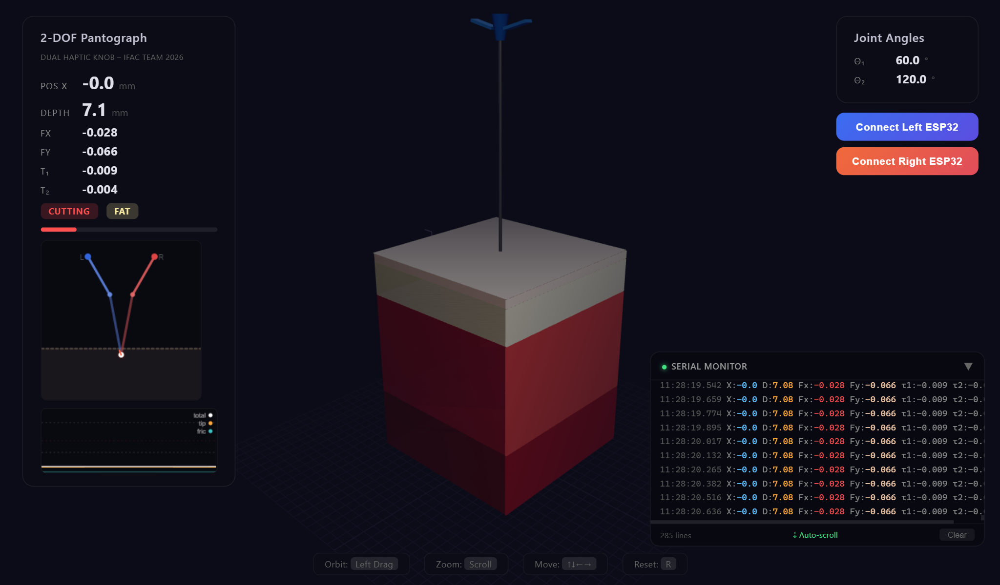
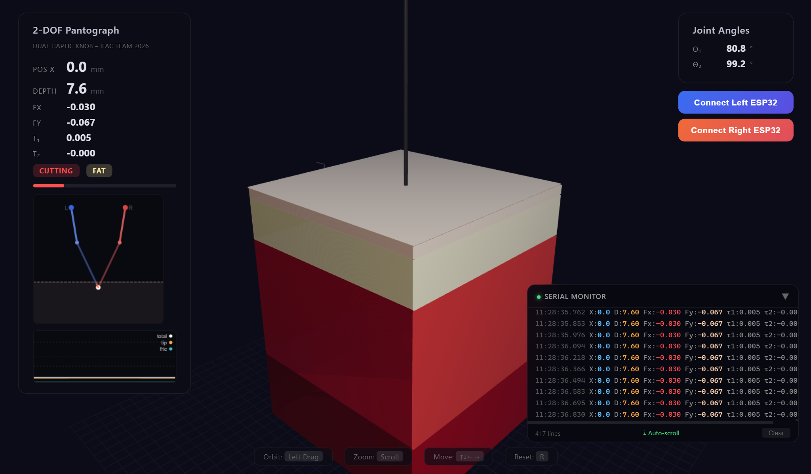
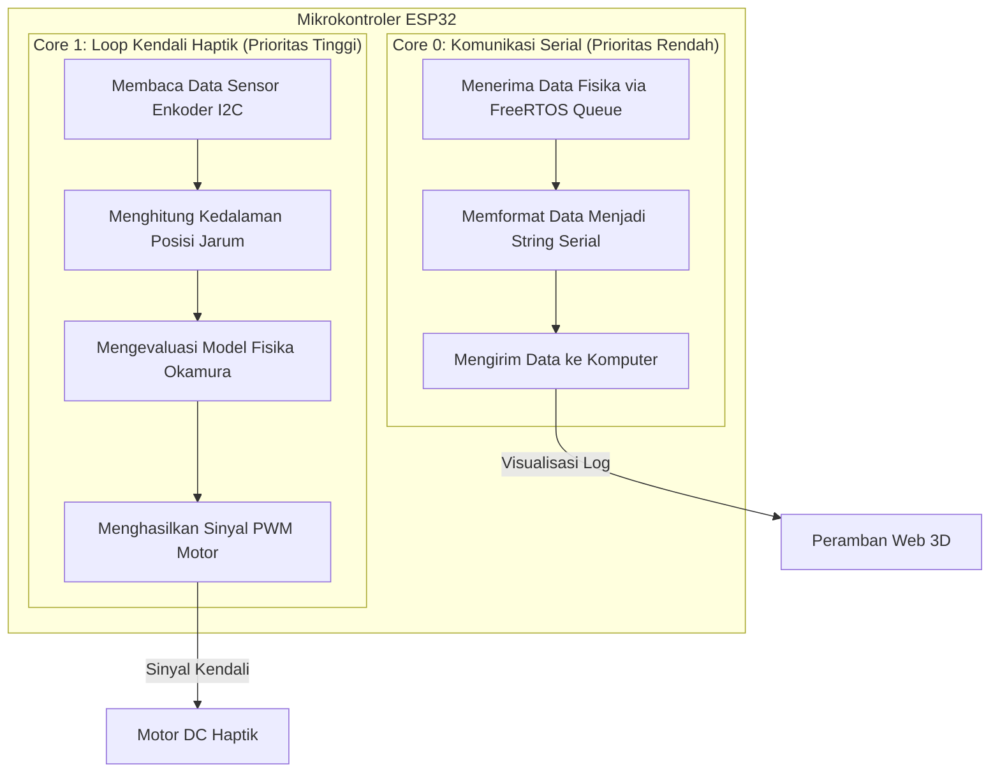

# Haptic Knob - Needle Insertion Simulation (ESP32)

**Demo Video:**
[Tonton Video Demonstrasi Sistem Melalui Instagram Reels](https://www.instagram.com/reel/DZNVUA0p1P7/?utm_source=ig_web_copy_link&igsh=MzRlODBiNWFlZA==)

## Cuplikan Antarmuka Sistem

Visualisasi tiga dimensi berbasis peramban web menampilkan lapisan jaringan, posisi jarum, tampilan Head-Up Display (HUD), dan grafik gaya secara waktu nyata.

| Sudut Pandang Pertama | Sudut Pandang Kedua |
|:------------:|:------------:|
|  |  |

## Tinjauan Umum Proyek

Proyek ini menghadirkan sebuah sistem simulasi umpan balik haptik berbasis fisika yang secara spesifik meniru sensasi penyisipan jarum menembus berbagai lapisan jaringan biologis. Pengembang merancang sistem ini dengan berlandaskan pada penelitian biomekanika yang telah dipublikasikan sebelumnya. Model gaya yang kami terapkan mampu memproduksi ulang enam fase penyisipan yang berbeda. Fase-fase ini mencakup penetrasi melewati tiga lapisan jaringan utama, di mana setiap lapisan memiliki karakteristik mekanis yang unik dan spesifik.

| Fase | Deskripsi Detail |
|-------|-------------|
| **Udara (Air)** | Sistem tidak memberikan resistansi gaya sama sekali ketika jarum berada di atas permukaan jaringan. |
| **Deformasi (Praruktur)** | Pengguna akan merasakan resistansi viskoelastis nonlinier seiring dengan perubahan bentuk atau deformasi jaringan akibat tekanan ujung jarum. |
| **Ruptur (Pecah)** | Sistem menghasilkan penurunan gaya yang terjadi secara instan persis pada saat ujung jarum berhasil menembus atau merobek lapisan jaringan. |
| **Pemotongan (Pascacabik)** | Sistem mempertahankan gaya konstan pada ujung jarum saat jarum bergerak memotong dan menembus ke dalam jaringan. |
| **Relaksasi** | Gaya haptik akan meluruh secara perlahan saat pengguna menghentikan pergerakan jarum di dalam jaringan. |
| **Ekstraksi** | Sistem memberikan gaya gesekan yang berlawanan arah untuk menahan gerakan penarikan jarum ke luar. |

## Arsitektur Komputasi Paralel (Sistem Multicore ESP32)

Proyek ini sangat mengandalkan paradigma komputasi paralel untuk memastikan simulasi fisika berjalan secara deterministik dan presisi tanpa hambatan dari proses antarmuka komunikasi. Mikrokontroler ESP32 memiliki arsitektur prosesor inti ganda (Dual-Core). Pengembang memanfaatkan sistem operasi waktu nyata FreeRTOS untuk membagi beban kerja komputasi secara eksplisit ke dalam dua inti prosesor yang berbeda.

Pendekatan komputasi paralel ini menyelesaikan masalah leher botol (bottleneck) yang sering terjadi pada mikrokontroler inti tunggal. Jika sistem menghitung fisika dan mengirim data serial secara berurutan, maka akan terjadi latensi yang merusak sensasi haptik. Dengan komputasi paralel, proses pembacaan sensor dan komputasi umpan balik gaya berjalan independen dari proses pengiriman log komunikasi menuju peramban web.



## Model Fisika Haptik

Pengembang mendasarkan perhitungan komputasi gaya pada dekomposisi gaya Okamura yang dipadukan dengan model kontak Mahvash-Dupont. Secara matematis, sistem menghitung gaya aksial total melalui persamaan berikut:

```text
Gaya Aksial Total = Gaya Kekakuan + Gaya Pemotongan + Gaya Gesekan
```

### Model Kontak (Fase Praruktur)

Sistem menggunakan pegas nonlinier Mahvash dan Dupont yang dikombinasikan dengan cabang viskoelastis Maxwell. Persamaan berikut merepresentasikan perhitungan gaya ujung jarum:

```text
Gaya Ujung = a2 * delta^2 + a1 * delta + K(delta) * delta_k

K(delta) = K' * delta_k (kekakuan yang bergantung pada tingkat deformasi)
tau = D'/K' (konstanta waktu viskoelastis)
```

Cabang Maxwell dalam model ini bertugas menyediakan relaksasi viskoelastis. Dengan mekanisme ini, gaya yang dirasakan pengguna akan meluruh secara alami ketika pengguna menghentikan dorongan pada jarum.

### Mekanisme Fraktur (Dari Ruptur ke Pemotongan)

Ketika gaya ujung jarum mencapai ambang batas ruptur (Fr), jaringan biologis akan mengalami penetrasi. Sistem menyimulasikan kejadian ini melalui penurunan gaya secara instan menuju tingkat gaya pemotongan konstan (Fc).

```text
Kejadian Penetrasi: Gaya ujung turun seketika dari Fr menjadi Fc
Pemotongan: Gaya ujung = Fc = Rf * wc (ketangguhan fraktur dikalikan dengan lebar retakan)
```

### Gesekan Poros (Gesekan Coulomb dan Viscous)

Nilai gesekan akan meningkat secara proporsional seiring dengan bertambahnya kedalaman penyisipan jarum, karena area kontak antara poros jarum dan jaringan menjadi lebih luas.

```text
Gaya Gesekan = (mu_shaft * kedalaman) + (B_viscous * kecepatan) + f_stiction
```

### Parameter Lapisan Jaringan Fisik

| Lapisan Jaringan | Kedalaman Ruang | Nilai a1 | Nilai a2 | Nilai K' | Waktu tau (detik) | Gaya Fr (Ruptur) | Gaya Fc (Pemotongan) |
|-------|-------|------|------|------|-------|--------------|--------------|
| **Kulit** | 0 hingga 2 milimeter | 0.08 | 0.12 | 0.20 | 0.04 | 0.55 | 0.08 |
| **Lemak** | 2 hingga 10 milimeter | 0.012 | 0.002 | 0.03 | 0.10 | 0.22 | 0.06 |
| **Otot** | 10 hingga 35 milimeter | 0.018 | 0.004 | 0.06 | 0.06 | 0.35 | 0.12 |

Pengembang merancang setiap lapisan agar memiliki karakteristik sensasi robekan yang berbeda. Kulit memiliki sifat kaku dengan tahanan ruptur yang kuat. Lemak terasa lebih lunak dan sangat patuh terhadap tekanan. Otot memiliki struktur berserat yang memberikan tingkat resistansi menengah.

## Kebutuhan Perangkat Keras

Sistem ini membutuhkan integrasi beberapa komponen perangkat keras yang spesifik untuk dapat berfungsi secara optimal:

1.  **Papan Pengembangan ESP32**: Bertindak sebagai otak komputasi utama yang memproses algoritma fisika dan mengendalikan modul lainnya.
2.  **Motor DC dengan Driver H-Bridge**: Pengembang menyarankan penggunaan modul driver TB6612FNG atau modul sejenis yang mampu mengendalikan arah dan kecepatan putaran motor secara presisi.
    *   Pin PWMA wajib terhubung ke pin IO18 pada ESP32.
    *   Pin AIN1 wajib terhubung ke pin IO19 pada ESP32.
    *   Pin AIN2 wajib terhubung ke pin IO23 pada ESP32.
3.  **Enkoder Putar Magnetik AS5600**: Sensor ini berkomunikasi melalui protokol antarmuka I2C untuk membaca sudut putaran secara presisi yang dikonversi menjadi kedalaman jarum.
    *   Pin SDA wajib terhubung ke pin IO21 pada ESP32.
    *   Pin SCL wajib terhubung ke pin IO22 pada ESP32.
4.  **Mekanisme Kenop Putar**: Pengguna harus memasang kenop putar fisik yang terhubung langsung ke poros motor untuk memberikan antarmuka interaksi mekanis dengan pengguna.

## Panduan Instalasi dan Konfigurasi Detail

Pengguna harus mengikuti prosedur instalasi berikut secara berurutan dan cermat untuk mengonfigurasi perangkat keras serta perangkat lunak sistem simulasi ini.

### 1. Prosedur Pemasangan Firmware ke ESP32

1.  **Unduh dan Instal Arduino IDE**: Pengguna perlu mengunduh versi terbaru Arduino IDE dari situs resmi Arduino dan melakukan instalasi pada sistem operasi komputer.
2.  **Konfigurasi Papan ESP32**: Buka menu *File*, lalu pilih *Preferences*. Pada kolom *Additional Boards Manager URLs*, pengguna wajib memasukkan tautan `https://dl.espressif.com/dl/package_esp32_index.json` untuk mengunduh pustaka papan pengembangan ESP32.
3.  **Instalasi Library ESP32**: Buka menu *Tools*, arahkan ke *Board*, lalu pilih *Boards Manager*. Lakukan pencarian dengan kata kunci "esp32" yang diterbitkan oleh Espressif Systems, kemudian klik tombol instal untuk menyelesaikan proses konfigurasi papan.
4.  **Buka Berkas Utama**: Buka berkas bernama `virtual-wall32.ino` yang terdapat di dalam direktori root proyek ini menggunakan aplikasi Arduino IDE.
5.  **Pemilihan Papan dan Port Komunikasi**: Buka menu *Tools*, atur opsi *Board* ke varian ESP32 yang pengguna gunakan (sebagai contoh, DOIT ESP32 DEVKIT V1). Selanjutnya, pilih port komunikasi (COM Port) yang sesuai dengan jalur koneksi kabel USB ke mikrokontroler ESP32.
6.  **Proses Pemindahan Kode**: Klik tombol *Upload* pada Arduino IDE dan tunggu instruksi layar hingga proses kompilasi kode dan pemindahan data (flashing) ke dalam memori ESP32 selesai sepenuhnya.

### 2. Menjalankan Sistem Visualisasi Tiga Dimensi

1.  **Gunakan Peramban Pendukung Web Serial**: Buka berkas `visualization3d.html` secara eksklusif menggunakan peramban Google Chrome atau Microsoft Edge. Pengembang mewajibkan penggunaan peramban ini karena kelancaran sistem sangat bergantung pada fungsionalitas antarmuka pemrograman aplikasi Web Serial (Web Serial API) yang secara bawaan tidak tersedia di semua peramban web.
2.  **Penyajian Berkas via Server Lokal (Sangat Disarankan)**: Agar peramban web dapat memuat keseluruhan aset dengan sempurna dan menghindari masalah kebijakan silang asal (CORS), pengguna sangat disarankan untuk menjalankan antarmuka ini melalui server web lokal. Pengguna dapat menggunakan ekstensi Live Server pada perangkat lunak Visual Studio Code, atau menggunakan aplikasi tumpukan peladen web mandiri seperti Laragon atau XAMPP. Buka antarmuka tersebut melalui alamat lokal, sebagai contoh: `http://localhost/Haptic-Knob-ESP32/virtual-wall32/visualization3d.html`.
3.  **Koneksi Perangkat Fisik**: Setelah antarmuka web terbuka dengan sempurna, klik tombol "Connect ESP32" yang terdapat pada antarmuka. Peramban web akan menampilkan kotak dialog pop-up konfirmasi port serial. Pilih port serial yang secara fisik terhubung dengan perangkat ESP32 pengguna, lalu konfirmasi dengan menekan tombol penghubung (Connect).

### 3. Konfigurasi Visualisasi Python Klasik (Pendekatan Opsional)

Bagi pengguna yang lebih mengutamakan penggunaan lingkungan visualisasi berbasis skrip Python, pengguna dipersilakan untuk mengonfigurasi dan menjalankan tahapan instruksi berikut melalui jendela terminal perintah.

1.  **Membangun Lingkungan Virtual**: Jalankan perintah `python -m venv venv` pada terminal untuk menciptakan sebuah lingkungan distribusi instalasi Python yang terisolasi dari sistem utama.
2.  **Proses Aktivasi Lingkungan Virtual**: Apabila pengguna beroperasi menggunakan platform sistem operasi Windows, jalankan perintah eksekusi skrip `venv\Scripts\activate`.
3.  **Memasang Modul Dependensi**: Jalankan perintah pemrosesan paket `pip install -r requirements.txt` untuk mengunduh dan mengonfigurasi seluruh modul pustaka pemrograman yang dibutuhkan oleh sistem visualisasi Python ini.
4.  **Menjalankan Program Visualisasi**: Eksekusi perintah `python visualization.py` untuk mengaktifkan antarmuka grafis visualisasi.

## Mekanisme Pengendalian Sistem

### Kontrol Antarmuka Visualisasi Tiga Dimensi pada Peramban

Sistem visualisasi menyediakan kumpulan fungsi pengendalian navigasi ruang untuk memfasilitasi pengguna dalam memantau secara presisi setiap tahap proses simulasi.

*   **Tahan dan Geser Tombol Kiri Tetikus**: Pengguna melakukan tindakan ini untuk merotasi orientasi sudut pandang kamera mengelilingi pusat objek tiga dimensi.
*   **Gulir Roda Tetikus**: Pengguna memanipulasi roda tetikus untuk mengontrol tingkat pembesaran atau pengecilan fokus tampilan visual pada area penyisipan.
*   **Tombol Navigasi Panah Atas dan Bawah**: Pengguna menggunakan tombol ini khusus untuk menyimulasikan pergerakan translasional jarum dalam ruang virtual apabila sistem perangkat keras mekanis sedang tidak terkoneksi.
*   **Tombol Pintasan Papan Ketik R**: Pengguna menekan tombol ini untuk menginisialisasi ulang kordinat posisi jarum kembali titik permukaan kulit terluar.
*   **Tombol Antarmuka Connect ESP32**: Pengguna menekan tombol layar ini untuk memicu dialog antarmuka pemrograman aplikasi peramban agar membuka jalur komunikasi serial dengan mikrokontroler perangkat keras.

### Kontrol Navigasi Visualisasi Python Klasik

*   **Tombol Navigasi Panah Atas dan Bawah**: Pengguna menekan tombol navigasi atas dan bawah untuk memaksa pergeseran simulasi arah dorongan jarum.
*   **Tombol Pintasan Papan Ketik R**: Pengguna menekan tombol R untuk mengatur ulang kalkulasi metrik spasial kalibrasi alat.
*   **Tombol Pintasan Papan Ketik ESC**: Pengguna menekan tombol Escape untuk mengirimkan perintah pembatalan eksekusi dan menutup program Python secara instan.

## Protokol Komunikasi Serial Sistem

Mikrokontroler ESP32 secara aktif dan konstan memancarkan paket data pembaruan status melalui jalur antarmuka serial dengan kecepatan modulasi 115200 baud pada frekuensi stabil 20 Hertz. Format enkapsulasi data berbentuk deret karakter kalimat (string) dengan format struktur nilai properti sebagai berikut:

`Depth_mm:12.34 Force_cmd:0.1823 State:1.0 Layer:1 FTip:0.0600 FFric:0.0370`

Pengembang memecah dan mendefinisikan masing-masing ruas variabel paket data sebagai berikut:
*   `Depth_mm` menunjukkan kalkulasi tingkat kedalaman translasional masuknya proksimal jarum dalam representasi satuan milimeter. Nilai angka 0 secara spesifik mengindikasikan bahwa jarum sedang beristirahat tepat di batas permukaan jaringan kulit terluar.
*   `Force_cmd` merepresentasikan besaran agregat daya keluaran yang didistribusikan menuju motor aktuator yang dinormalisasi dalam rentang nilai desimal 0 hingga 1.
*   `State` menggambarkan parameter kuantitatif siklus interaksi fisika ujung jarum dengan lingkungan. Nilai angka 0 melambangkan bahwa jarum sedang bergerak bebas di medium udara. Nilai 0.5 mendefinisikan bahwa jaringan sedang berada pada fase praruktur atau proses deformasi bentuk dasar. Nilai 1.0 mengonfirmasi bahwa ujung jarum tengah melakukan penetrasi pada fase pemotongan serat jaringan biologis secara konstan.
*   `Layer` menunjukkan kordinat posisional lapisan spasial dari jaringan medium tempat ujung jarum saat ini berada secara waktu nyata. Sistem menggunakan nilai -1 untuk medium udara bebas, indeks 0 untuk jaringan epidermal kulit, indeks 1 untuk jaringan subkutan lemak, dan indeks 2 untuk formasi massa otot.
*   `FTip` menginformasikan nilai derivatif kalkulasi komputasional dari resistansi dinamis gaya yang tereksitasi khusus memengaruhi area permukaan sentuh ujung jarum.
*   `FFric` menginformasikan nilai derivatif kalkulasi fiksasi gesekan kumulatif kinetis yang secara natural memberikan resistensi penghambat gerakan linier di seluruh area bidang luas permukaan batang poros luar jarum.

## Prosedur Inisiasi dan Kalibrasi Alat Fisik

Pengguna sistem sangat diwajibkan untuk melaksanakan prosedur kalibrasi inisialisasi awal. Langkah operasional ini berfungsi untuk menetapkan ulang titik nol referensi kartesian dari instrumen mekanis motor sebelum eksekusi percobaan berlangsung.

1.  Berikan daya masukan listrik yang memadai pada seluruh komponen papan sirkuit perangkat. Instrumen kenop mekanis tersebut akan secara otonom merotasi sumbu untuk mencari dan mengunci posisi referensi titik tengah spasial pada batas geometri rotasi 180 derajat.
2.  Pengguna wajib menahan kenop sentral tersebut dalam posisi ekuilibrium atau stabil total selama masa durasi pengawasan waktu dua detik penuh berturut-turut.
3.  Sistem komputasi secara mandiri akan segera merekam jejak posisi diam rotasional tersebut untuk kemudian diartikulasikan sebagai batas kordinat vertikal nol absolut pada ekuator permukaan luar kulit simulasi.
4.  Pengguna dapat langsung memanipulasi rotasi putar mekanis perangkat kenop searah gerakan jarum jam (Clockwise) untuk memproduksi gaya simulasi gaya dorong penetrasi linear masuknya ujung jarum, serta memanipulasi torsi putaran ke arah yang berlawanan (Counter-Clockwise) untuk menciptakan efek tarik gaya ekstraksi linier keluarnya keseluruhan bodi jarum.

## Panduan Analisis Penanganan Kendala Teknis (Troubleshooting)

### Perangkat Visualisasi Tiga Dimensi Menolak Membuka Sesi Koneksi

Pengguna pertama-tama harus merefleksikan spesifikasi peramban dan memastikan telah menggunakan produk peramban web mutakhir seperti Google Chrome atau Microsoft Edge. Pengguna patut mengingat bahwa protokol antarmuka akses Web Serial API sangat krusial serta bersifat mutlak agar jalur komunikasi berhasil terjadi. Apabila keluhan terus berlanjut, periksa dan validasi koneksi konduktor pada jalur kabel USB sembari mengonfirmasi bahwa pustaka paket driver komunikasi portabilitas jembatan (seperti chipset IC CH340 atau IC CP210x) telah dimuat secara benar oleh *kernel* inti sistem operasi.

### Aktuator Motor DC Gagal Mengimplementasikan Umpan Balik Mekanis

Pengguna perlu secara aktif memverifikasi tingkat kompatibilitas jalur skema perakitan kabel elektronika agar struktur pin perangkat keras tidak bertentangan dengan blok definisi kode program di dalam berkas komponen `knob.cpp`. Pastikan dengan saksama bahwa struktur kabel pin IO18, IO19, dan IO23 sepenuhnya terintegrasi ke blok port modul papan driver kendali motor, di samping memastikan bahwa pin antarmuka IO21 serta IO22 telah menjalin komunikasi yang solid dengan pin port modul enkoder rotasional protokol I2C. Pengguna juga wajib memastikan pasokan sumber energi catu daya memiliki cukup suplai arus listrik (Ampere) yang esensial guna memenuhi kehausan energi operasional motor DC berkinerja tinggi.

### Kurva Kurvatur Resistansi Umpan Balik Gaya Terasa Anomali atau Kurang Akurat

Pengguna proyek riset ini selalu diberikan privilese modifikasi tanpa batas untuk menyetel ulang koefisien matematis fisis model lingkungan masing-masing simulasi anatomi lapisan jaringan. Pengaturan variabel ini tersusun dengan rapi pada indeks blok memori *array* `layers[]` di dalam *source code* utama `virtual-wall32.ino`. Bagi pengguna lanjut, disarankan pula untuk secara iteratif melaksanakan tuning modifikasi manipulasi besaran tetapan konstanta kalkulasi variabel makro `MU_SHAFT` serta rentang `B_VISCOUS` guna menciptakan manifestasi realitas hambatan tarik gesekan poros yang senatural mungkin.

## Daftar Pustaka dan Referensi Akademik Riset

Sistem simulasi antarmuka haptik tingkat lanjut ini secara metodologis direkayasa dan dibangun dengan berasaskan landasan empiris literatur ilmiah terpandang yang meneliti ranah kontrol komputasi haptik serta pemodelan sistem dinamika biomekanika jaringan:

*   Okamura, A. M., Simone, C., & O'Leary, M. D. (2004). *Force modeling for needle insertion into soft tissue*. IEEE Trans. Biomedical Engineering, 51(10), 1707-1716.
*   Mahvash, M. & Dupont, P. E. (2010). *Mechanics of dynamic needle insertion into a biological material*. IEEE Trans. Biomedical Engineering, 57(4), 934-943.
*   Delbos, B., Chalard, R., Lelevé, A., & Moreau, R. (2024). *A generalized tracking wall approach to the haptic simulation of tip forces during needle insertion*. IEEE Trans. Haptics, 18(1), 110-123.

## Penetapan Hak Cipta dan Lisensi Distribusi Penggunaan

Para akademisi beserta keseluruhan struktur unit divisi pengembang riset mendedikasikan secara utuh proyek rancang bangun sumber terbuka ini semata-mata dengan tujuan mulia guna memajukan agenda pendidikan fundamental, menyokong transfer keilmuan eksploratif, serta secara kolektif menyukseskan program penelitian lanjutan tanpa tendensi dan muatan unsur komersialisasi.

**Tim Pengembang:**
IFAC 2026 Team - Niceknob ITENAS
* Zakhwa Aliya (152024032)
* Dzakiyya Puteri Aulia (152024127)