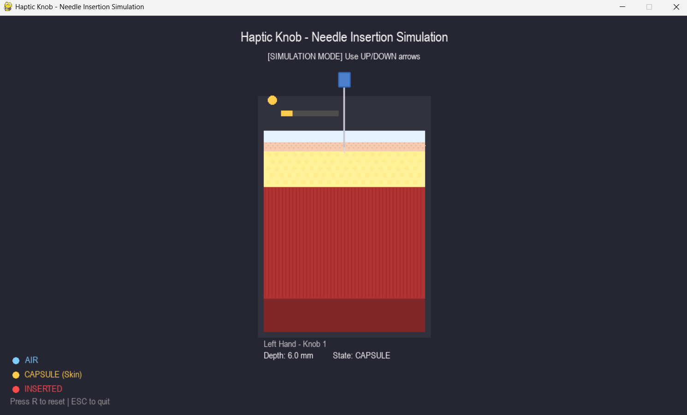

# Haptic Knob – Needle Insertion Simulation (ESP32)

A haptic feedback system that simulates the feel of needle insertion through multi-layer tissue using an ESP32, motor-driven force feedback, and real-time 3D visualization.



## Overview

This project implements a physics-based needle insertion haptic simulation grounded in published biomechanical research. The force model reproduces six distinct phases of insertion across three tissue layers, each with unique mechanical properties:

| Phase | Description |
|-------|-------------|
| **Air** | No resistance above the surface |
| **Deformation (Pre-rupture)** | Nonlinear viscoelastic resistance as tissue deforms |
| **Rupture ("Pop")** | Instantaneous force drop when tissue punctures |
| **Cutting (Post-rupture)** | Constant tip force as needle cuts through tissue |
| **Relaxation** | Force decays when motion stops inside tissue |
| **Extraction** | Friction opposes withdrawal |

## Physics Model

Based on the Okamura force decomposition with Mahvash-Dupont contact model:

```
f_axial = f_stiffness + f_cutting + f_friction
```

### Contact Model (Pre-rupture)

Mahvash & Dupont nonlinear spring + Maxwell viscoelastic branch:

```
f_tip = a?·?² + a?·? + K(?)·?_k

K(?) = K'·?          (deformation-dependent stiffness)
? = D'/K'             (viscoelastic time constant)
```

The Maxwell branch provides viscoelastic relaxation — force decays when the user stops pushing.

### Fracture (Rupture ? Cutting)

When tip force reaches the rupture threshold **Fr**, the tissue punctures with an instant force drop to the constant cutting force **Fc**:

```
Puncture event:  f_tip jumps from Fr ? Fc   (pop-through sensation)
Cutting:         f_tip = Fc = Rf · wc       (fracture toughness × crack width)
```

### Shaft Friction (Coulomb + Viscous)

Friction increases with insertion depth (more shaft-tissue contact area):

```
f_friction = ?_shaft · depth + B_viscous · velocity + f_stiction
```

### Tissue Layer Parameters

| Layer | Depth | a? | a? | K' | ? (s) | Fr (rupture) | Fc (cutting) |
|-------|-------|------|------|------|-------|--------------|--------------|
| **Skin** | 0–2 mm | 0.08 | 0.12 | 0.20 | 0.04 | 0.55 | 0.08 |
| **Fat** | 2–10 mm | 0.012 | 0.002 | 0.03 | 0.10 | 0.22 | 0.06 |
| **Muscle** | 10–35 mm | 0.018 | 0.004 | 0.06 | 0.06 | 0.35 | 0.12 |

Each layer has a distinct "pop" feel: skin is stiff with a strong rupture, fat is soft and compliant, muscle is fibrous with moderate resistance.

## Hardware Requirements

- ESP32 development board
- DC Motor with H-Bridge driver (TB6612FNG or similar)
  - PWMA ? IO18
  - AIN1 ? IO19
  - AIN2 ? IO23
- AS5600 Magnetic Rotary Encoder (I2C)
  - SDA ? IO21
  - SCL ? IO22
- Rotary knob mechanism attached to motor shaft

## Software Requirements

### ESP32 Firmware
- Arduino IDE or PlatformIO
- Arduino framework for ESP32

### 3D Visualization (Browser)
- Chrome or Edge (Web Serial API support)
- No installation needed — open `visualization3d.html` in browser

### Legacy Python Visualization (optional)
- Python 3.8+
- Dependencies in `requirements.txt`

## Installation

### 1. Flash the ESP32

1. Open `virtual-wall32.ino` in Arduino IDE
2. Install ESP32 board support if not already installed
3. Select your board and COM port
4. Upload the sketch

### 2. Run the 3D Visualization

Open `visualization3d.html` in Chrome or Edge, then click **Connect ESP32** to pair the serial device.

Or serve it via a local web server (e.g., Laragon, Live Server):
```
http://localhost/niceknob-esp32/virtual-wall32/visualization3d.html
```

### 3. (Optional) Python Visualization

```bash
python -m venv venv
venv\Scripts\activate        # Windows
pip install -r requirements.txt
python visualization.py
```

## Controls

### 3D Visualization (Browser)

| Control | Action |
|---------|--------|
| Left Drag | Orbit camera |
| Scroll | Zoom in/out |
| ? / ? Arrows | Simulate needle movement (no hardware) |
| R | Reset to surface |
| Connect ESP32 | Pair serial device |

### Legacy Python Visualization

| Key | Action |
|-----|--------|
| UP / DOWN | Simulate needle movement |
| R | Reset calibration |
| ESC | Quit |

## Serial Protocol

The ESP32 outputs at 115200 baud, 20 Hz:

```
Depth_mm:12.34 Force_cmd:0.1823 State:1.0 Layer:1 FTip:0.0600 FFric:0.0370
```

| Field | Description |
|-------|-------------|
| `Depth_mm` | Needle depth in mm (0 = surface) |
| `Force_cmd` | Total motor output magnitude (0–1) |
| `State` | 0 = Air, 0.5 = Deform, 1.0 = Cutting |
| `Layer` | -1 = Air, 0 = Skin, 1 = Fat, 2 = Muscle |
| `FTip` | Tip force (stiffness or cutting) |
| `FFric` | Shaft friction force |

## Calibration

1. Power on the device — the knob auto-homes to ~180°
2. Hold the knob steady for 2 seconds
3. The current position is set as the skin surface (0 mm)
4. Rotate clockwise to insert, counter-clockwise to extract

## File Structure

```
virtual-wall32/
??? virtual-wall32.ino    # ESP32 firmware (Okamura + Mahvash-Dupont model)
??? knob.h                # Motor + encoder library header
??? knob.cpp              # Motor + encoder library implementation
??? visualization3d.html  # Three.js 3D visualization (browser)
??? visualization.py      # Legacy pygame/OpenGL visualization
??? requirements.txt      # Python dependencies
??? .gitignore
??? README.md
??? images/
    ??? Visualization.png
    ??? Simulation.mp4
```

## Troubleshooting

### 3D visualization won't connect
- Use **Chrome** or **Edge** (Web Serial API required)
- Check USB connection and COM port drivers (CP210x or CH340)

### Motor not responding
- Verify wiring matches pin definitions in `knob.cpp` (IO18, IO19, IO23 for motor; IO21, IO22 for I2C)
- Check motor driver power supply

### Force feels wrong
- Adjust layer parameters in `virtual-wall32.ino` (`layers[]` array)
- Tune `MU_SHAFT` and `B_VISCOUS` for friction feel

## References

- Okamura, A. M., Simone, C., & O'Leary, M. D. (2004). *Force modeling for needle insertion into soft tissue*. IEEE Trans. Biomedical Engineering, 51(10), 1707–1716.
- Mahvash, M. & Dupont, P. E. (2010). *Mechanics of dynamic needle insertion into a biological material*. IEEE Trans. Biomedical Engineering, 57(4), 934–943.
- Delbos, B., Chalard, R., Lelevé, A., & Moreau, R. (2024). *A generalized tracking wall approach to the haptic simulation of tip forces during needle insertion*. IEEE Trans. Haptics, 18(1), 110–123.

## License

This project is for educational and research purposes.
